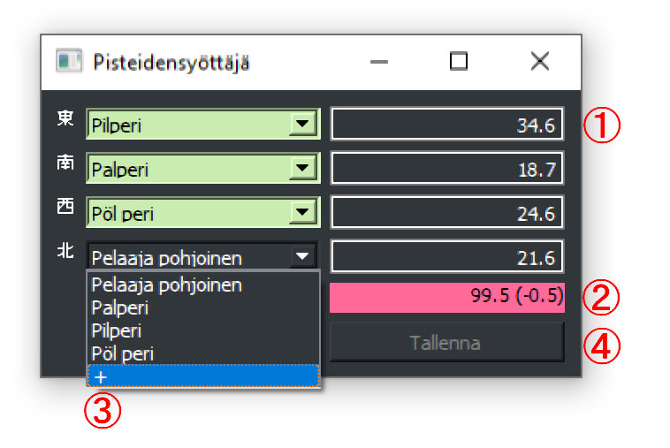

2025-01-10
# Kirjasto mahjong-pelitulosten kirjaamiseen

## Yksinkertainen tulostallennuskirjasto

Tarkoitettu korvaamaan aiempi SQL-tietokantaan perustuva, jonka tulokset katosivat ikävän vääräsuuntapipe-operaation myötä.
Kielenä Python, designperiaatteena _"olla niin yksinkertainen että tulokset voi tarvittaessa kirjata vaikka tekstieditorilla."_

## Asennus ja käyttö

Asennuksen _pitäisi_ olla niinkin yksinkertaista kuin `pip install git+https://github.com/Pilperi/mahjongtilasto`
Asennus luo pikakomennon `mahjongtilasto`, jota kun kutsuu niin ruutuun hypähtää GUI (Qt5).

</img>

Pisteet kirjoitetaan pistelaatikoihin (1). Formaatti on melko vapaa: 12.3 on validi, +12,3 on validi, -12300 on validi. Kenttään ei voi laittaa kiellettyjä merkkejä. Kirjaajan päätettävissä merkataanko delta aloituksesta vai paljonko on tikkuja.
Pistelaatikoiden alla on pistesummatarkastin (2), joka näyttää mihin lukuun syötetyt pisteet summautuvat ja paljonko on eroa johonkin tunnettuun lukemaan (4x0 / 4x30k / 4x25k). Jos summa heittää, ruutu on punainen ja kun mätsää se muuttuu vihreäksi.
Pelaajien nimet valitaan pudotusvalikosta (3). Jos sama pelaaja on merkattu useammalle paikalle, se korostetaan punaisena ja muutoin vihreänä. Listan lopussa olevasta `+` saa lisättyä uuden pelaajan.
Kun sekä pelaajanimet että pisteet on kunnossa, Tallenna-nappi (4) muuttuu painettavaksi. Ekalla kerralla se kysyy tiedostoa johon tallennetaan. Jos valitsee olemassaolevan tiedoston, tulokset lisätään sen loppuun (ts. ei ylikirjoita vaan vanhat tulokset säilytetään).

Tulosten käpistelypuolta ei ole vielä tehty (pelaajan pelien nettosummat, uma-laskenta jne). Tulossa aikanaan.

## Motivaatio

Kertsin pelit on viimesen vuoden-pari(kolme? viis?) ollu sellaisia ettei lopputuloksia kirjata mihinkään ylös.
Tämä hähmöittää sitä, miten hyvin tai huonosti oikeastaan on mennyt, ja mitä korjausliikkeitä omaan pelityyliin tarttisi tehdä.
Jonkinlainen kirjausformaatti olisi siis oltava. Vanha kirjaussofta vissiin _on_ periaatteessa vielä olemassa, mutta siihen oli muutenkin tarkoitus tehdä korjauksia.

## Aiempien toteutusten vertailu

### Kirjaus Discordiin ja siitä eteenpäin Googlen taulukkolaskentaan

Tämä oli itse asiassa aika toimiva, plussina:
- Formaatti on vapaa: tyyppi joka naputtelee tulokset myöhemmin taulukkoon vastaa siitä että luvut on lopulta taulukon haluamassa muodossa
- Aikataulu on vapaa: tulokset kirjattiin heti pelin päätyttyä helpolla formaatilla, muuntuvat käpisteltävään muotoon sitten aikanaan
- Yksinkertainen toteutus: vaikka kertsin kone olisi irti netistä, _jollakulla_ pöytäläisellä on kännykässä Discord auki

Miinuksina:
- Sama työ kahteen kertaan: pöytäläinen naputtelee tulokset kerran ja joku toinen uudelleen sitten joskus myöhemmin
- Virhealtis: Discord ei tarkista täsmääkö pisteet, paljastuu sitten kun tuloskirjaaja latoo luvut taulukkoon ja silloin on jo myöhäistä
- Laskennallisesti hidas: lukujen käpistely oli yhdistetty samaan taulukkoon, ja ei kovin montaa sataa peliä tarvita että taulukko selaimessa alkaa hyytyä

### Kirjaus dedikoidulla SQL-softalla

Ajatuksena hyvä, mutta suoraan sanottuna yli-insinöröity. Plussina:
- Virhevapaa: ohjelmallinen pistetarkistus, pelaajanimissä ei typoja koska ei tukenut uuden pelaajan lisäämistä "lennosta"
- Käpistelyvalmis: tulosten analysointi helppoa kun osa samaa ohjelmistoa
- Nopea: SQL-tietokannasta tulosarkistojen noutaminen ja käpistely nopeaa, ei enää hyytyvän taulukon ongelmaa

Miinuksina:
- Poropietari: tulosten kirjaamiseen ja lukemiseen tarvitsi erityisen ohjelman (mikä ennen pitkään johti väärän suunnan pipettämiseen ja tulosten katoamiseen)
- Uusien pelaajien lisääminen oli kankeaa


## Uuden toteutuksen piirteet

Pääpointtina tässä uudessa toteutuksessa on yksinkertaisuus. Ajatuksena ottaa hyvät puolet aiemmista toteutuksista, toisin sanottuna
- Vapaa formaatti: Tulosten kirjaamisen pitää olla yhtä helppoa kuin Discord-viestin naputtelu
  - Pisteet muodossa 21.3 tai 21300, ei väliä
  - Pelaajan Nimi 21.3
- Helposti muokattavissa
  - Tulokset oltava jälkikäteen helposti korjattavissa (pelaajanimessä typo)
  - Tulosten tallentaminen/korjaaminen ei saa _vaatia_ mielivaltaista tekstieditoria kummempaa ohjelmaa (ks. SQL-taulukkoon kenttien lisäily)
- Helposti käpisteltävissä, joko samalla softalla tai saman softan komponentteja käyttäen
  - Tulokset oltava muodossa jossa läsnä pelin päiväys ja pelaajien aloitustuulet
  - Oltava luettavissa koneellisesti

### Luotu dataformaatti

Yksittäinen kirjaus on viiden rivin pätkä, jonka osat on eroteltu rivinvaihdoilla. Elementit ovat (järjestyksessä)
1. ID
2. Aloittavan idän nimi ja loppupisteet
3. Aloittavan etelän nimi ja loppupisteet
4. Aloittavan lännen nimi ja loppupisteet
5. Aloittavan pohjoisen nimi ja loppupisteet

`ID`:n kriteerit ovat
1. Uniikkius (esim. UUID, ULID, juokseva numerointi)
2. Sisältää tiedon kirjausajasta (esim. ULID)
3. Helppo sortattavuus ajan mukaan (ULID)
4. Helppo käsin kirjattavuus (ei todellakaan ULID)

Ehdot täyttävä ID on ihmislukuinen aikaleima. Ehdotettu formaatti on muotoa `YYYY-mm-dd-HH-MM` (`2024-12-14-13-26`). Formaatin tulee olla joustava:
- Jos joku ei jaksa tunteja ja minuutteja kirjata, se sallittakoon
  - Pelkkä päivämäärä ja juokseva numerointi OK (esim. `2024-12-14-0`)
- Toiseen suuntaan: tarkemmat ajan muodot oltava hyväksyttäviä
  - Kun tulokset kirjataan tulossoftalla, helppo taattu uniikkius saadaan tuomalla sekunnit mukaan (`2024-12-14-13-26-19`)

Pelaajatulosten kriteerit vastaavanlaiset, asiat pitää voida kirjoittaa helposti.
Ehdotettu formaatti on `Pelaajan Nimi 21.3`/`Pelaaja 21300` eli välilyönnein erotettu `str` jossa viimeinen pätkä on pistelukema. Ehkä jopa niin että `Pelaajan nimi: 21.3` myös tuettu ja vika `:` parsitaan pois jos läsnä.

Pelikohtaiset kommentit voisivat myös olla sallittuja, `#` aloitettuina.

Kokonaisuudessaan yksittäinen kirjaus olisi siten esimerkiksi
```
2024-12-14-13-26
Jaska Jonkkaaja 27.3
Maisa Mahjonki 29.4
Chombowski -4.8
Kalle 48.1
```

Tälle on tehty parseri, tällä hetkellä yksinkertainen eli lukee kunnes löytää validin aikaleiman ja sen jälkeisistä neljästä rivistä tulokset.
Ei siis (vielä) tue sitä että välissä on kommentteja.
