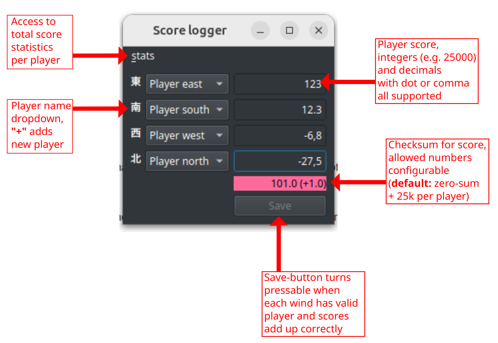

2026-03-29
# Library for handling mahjong game results

## A simple hanchan result logger

A Python based package for logging game end results. Target is to have a format that is so easy that it's possible to write entries by hand with standard text editor, but at the same time have them machine-readable. As a bonus a GUI which won't let one write entries that are clearly not correct, i.e. one thousand is missing because someone forgot they get their riibou back, someone calculated that their 1300 points minus 3900 leaves them at -2200 points etc. etc.

## Installation

Installation _should_ be as easy as

```bash
pip install git+https://github.com/Pilperi/mahjongtilasto
```

Installation creates an alias `mahjongtilasto` that can be called from command line both in Windows and on linux. Calling it starts by default the GUI view for logging end scores. As with any modern Python package, you might need to do some virtual environment management to get things going.

In releases, there's also a clunky exe available for Windows.

## Use

</img>

Player end score values are entered on the score boxes (on the righ). Entry format is flexible: 12300 is valid, 12.3 is valid, even 12,3 is valid. Field has a parser which won't let user enter anything illegal into it, so no worries. It's up to user to decide whether scores are entered as a difference from starting points (sum to zero) or as sticks in players possession (sum to 100 k or 120 k). This is configurable via `settings.ini` and as default is set to zero sum or 100 k format.

Under the score entries is the score sum, which is red if scores don't add up and green if they are ok. It also shows how much the score is off.

Player names are set with drop down menus (on the left). Same name cannot be selected for multiple starting positions. At the end of name list is `+` which jumps to view for adding a new player.

Once both player names and player scores are OK, Save button at the bottom right turns active and result can be saved. On the first save of a session program asks for file into which results are saved. If user selects an existing file, result is appended to it, i.e. it's not overwritten but appended to.

**Hint:** one can jump between fields with Tab key and press Save with Enter.

## Configuring with `settings.ini`

Starting from `v2026.03.28.0` one can configure various program functionalities via config file `settigns.ini`. File is created at user home folder:
- `~/.config/mahjongtilasto/settings.ini` on linux
- `%USERPROFILE%/.config/mahjongtilasto/settings.init` on Windows

Tunable parameters are
```ini
[SETTINGS]
lang = FI or ENG, language of GUI
points = Allowed point sums separated with slash, as default 100/100000/0 i.e. points need to add up to either 100 k or 0
uma = Uma values separated with slash, starting from top placement. Default value is EMA standard 15000/5000/-5000/-15000
resultfile = Location of result file. If set, same file is always used (otherwise changes as year changes).
```

If one wishes to use English GUI, they need to set `lang = ENG`. If one wishes to allow only zero-sum score format, they need to set `points = 0`, whereas for 30 k format they would set `points = 30/30000` etc. Default value for `points` is `100/100000/0`.

If one screws things up badly and has no idea how to fix the system (??), they can just remove `settings.ini` and on the next startup program will create new one with default values in it.
